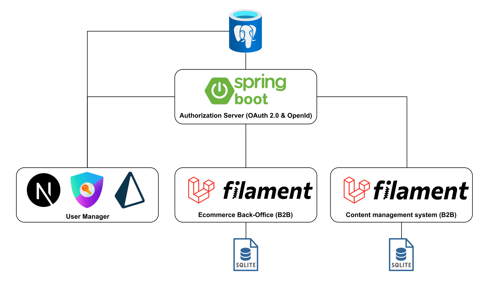

# System Architecture and Setup

This document outlines the system architecture and provides setup instructions for running the project.

## Architecture

The system consists of five main components:

-   **PostgreSQL Database:** Stores user-related information.
-   **Authorization Server (Spring Boot):** Implements OAuth 2.0 and OpenID Connect for authentication and authorization.
-   **User Management Application (Next.js):** Provides an administrative interface for user management.
-   **E-commerce Management System (Laravel):** Manages e-commerce operations.
-   **Content Management System (CMS) (Laravel):** Manages digital content.

The Authorization Server handles authentication and authorization for the User Management Application, E-commerce Management System, and CMS. The User Management Application allows administrators to manage users and their roles, which in turn affect access to the E-commerce and CMS platforms.



## Setup Instructions

To set up and run the project, follow these steps:

1.  **Docker Compose:**
    -   Ensure you have Docker and Docker Compose installed.
    -   Navigate to the project directory in your terminal.
    -   Run the following command to start the containers:

        ```bash
        docker compose up
        ```

2.  **Host File Configuration:**
    -   Add the following entries to your host file (`C:\Windows\System32\drivers\etc\hosts` on Windows):

        ```
        127.0.0.1 auth
        127.0.0.1 ecommerce
        127.0.0.1 cms
        127.0.0.1 user-manager
        ```

    -   This allows you to access the applications using the specified hostnames.

After completing these steps, the applications should be running and accessible through your web browser.